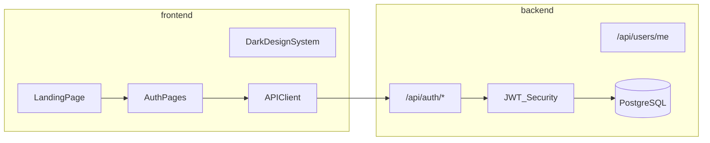

# StudentOS — Scaffold Defaults Confirmed

**Verdict: go ahead.** No changes needed to your proposed defaults. They align with the full StudentOS spec from your earlier message.

## Confirmed Defaults

| Setting | Value |
|---------|-------|
| Project name | `StudentOS` |
| Location | [`~/StudentOS`](/Users/mdrahil/StudentOS) |
| Layout | Monorepo: [`frontend/`](/Users/mdrahil/StudentOS/frontend) (Next.js) + [`backend/`](/Users/mdrahil/StudentOS/backend) (Spring Boot) |
| VCS | `git init` at repo root |
| Local infra | Root [`docker-compose.yml`](/Users/mdrahil/StudentOS/docker-compose.yml) — Postgres + Redis |
| Docs | Root [`README.md`](/Users/mdrahil/StudentOS/README.md) + [`.env.example`](/Users/mdrahil/StudentOS/.env.example) |

Verified: no `~/Projects`, `~/Developer`, or existing `~/StudentOS` directory.

## Sensible Defaults (locked in for scaffold)

**Root monorepo**
- [`.gitignore`](/Users/mdrahil/StudentOS/.gitignore) — Node, Java, IDE, `.env`
- [`docker-compose.yml`](/Users/mdrahil/StudentOS/docker-compose.yml) — Postgres 16, Redis 7, named volumes, healthchecks
- [`.env.example`](/Users/mdrahil/StudentOS/.env.example) — DB URL, JWT secret, Redis, AI keys (Gemini/OpenAI), CORS origin

**Frontend** ([`frontend/`](/Users/mdrahil/StudentOS/frontend))
- Next.js (App Router) + TypeScript + Tailwind CSS
- shadcn/ui + Lucide icons
- React Hook Form + Zod
- Dark theme design tokens (charcoal bg, muted borders, subtle blue/indigo accent) applied globally
- Auth pages: `/login`, `/register`, `/forgot-password`
- API client layer in `lib/` or `services/` pointing at Spring Boot (`http://localhost:8080`)

**Backend** ([`backend/`](/Users/mdrahil/StudentOS/backend))
- Spring Boot 3.x, Java 21, Maven wrapper (`./mvnw` — no global Maven required)
- Package: `com.studentos`
- Spring Security + JWT (access + refresh), BCrypt passwords
- Spring Data JPA + **Flyway** migrations (not Hibernate auto-ddl in prod path)
- springdoc-openapi (Swagger UI at `/swagger-ui.html`)
- Redis starter wired for future caching; minimal use in Phase 1
- AI service abstraction stub (mock responses when keys unset)

**Ports**
- Frontend: `3000` | Backend: `8080` | Postgres: `5432` | Redis: `6379`

## Environment Prerequisites (action needed on your machine)

Current system check:
- Node.js **v26** — OK for Next.js scaffold
- **Java** — not installed (required to run backend)
- **Docker** — not installed (required for Postgres/Redis via Compose)

Scaffolding can proceed without these, but to run Phase 1 locally you will need:
1. **JDK 21** (e.g. `brew install openjdk@21`)
2. **Docker Desktop** (e.g. `brew install --cask docker`)

Maven is not required — the Spring Boot project will include the Maven wrapper.

## Phase 1 Scope (what gets built after scaffold)

**Database entities (Phase 1 minimum)**
- `User`, `Role`, `StudentProfile` — UUID IDs, `createdAt`/`updatedAt`, proper relationships

**APIs (Phase 1)**
- `POST /api/auth/register`, `login`, `refresh`
- `GET/PUT /api/users/me`
- OpenAPI docs exposed

**Frontend (Phase 1)**
- Landing page (clean dark, no flashy effects)
- Auth flows with validation, loading/error states
- Protected route middleware for `/dashboard` (shell only — full dashboard is Phase 2)
- JWT stored securely (httpOnly cookie or memory + refresh pattern — cookie-based preferred for XSS safety)

**Explicitly deferred** to later phases: dashboard content, study planner, AI features, projects, internships, resume, notifications, admin panel, GitHub Actions CI, production deployment.

## Scaffold Steps (execution order)

1. Create [`~/StudentOS`](/Users/mdrahil/StudentOS), `git init`, call `move_agent_to_root` before any file work
2. Add root config: `.gitignore`, `docker-compose.yml`, `.env.example`, `README.md` (setup skeleton)
3. Scaffold Next.js app in `frontend/` with Tailwind + shadcn/ui + dark theme
4. Scaffold Spring Boot app in `backend/` via Spring Initializr equivalent (Maven wrapper, deps listed above)
5. Wire backend to Postgres/Redis via env vars matching Compose service names
6. Implement Flyway `V1__init.sql` for User/Role/StudentProfile
7. Implement auth endpoints + Spring Security filter chain
8. Build auth UI + landing page consuming real APIs
9. Verify: register → login → protected `/dashboard` redirect works end-to-end

## One Optional Future Consideration (not blocking)

If you later want all repos under a standard folder, you can move `~/StudentOS` → `~/Projects/StudentOS` before much work lands. No need to change the plan now.
